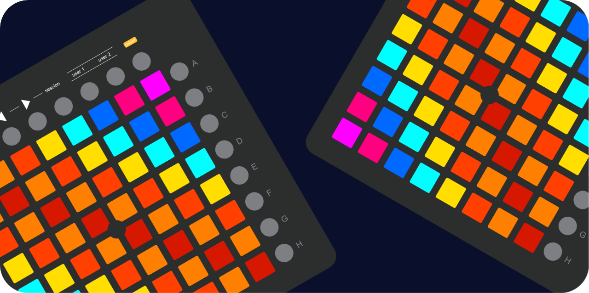

# LaunchControl

LaunchControl is a flexible framework and UI library that integrates support for Novation Launchpads and various MIDI devices. Whether you’re building music apps, controllers, or custom MIDI workflows, it provides the tools and components to create rich, interactive MIDI experiences.

The framework includes customizable UI components that visually represent device button grids and controls, enabling developers to build intuitive interfaces easily. LaunchControl supports real-time MIDI communication for fast, reliable message exchange, and works across both macOS and iOS platforms. With built-in LED feedback and animation support, you can create vibrant visual responses on compatible devices. Its modular design lets you use only the components you need or extend functionality to suit your requirements.

### Supported Devices

| Device Model                | Support    |
| :---------------------:     | :--------: |
| Novation Launchpad Mini     | ✅         |
| Novation Launchpad Mini Mk2 | ✅         |
| Novation Launchpad Pro Mk3  | ✅         |
| Novation Launchpad X        | ✅         |
| Novation Launchpad Mk2      | ✅         |
| Novation Launchpad S        | ✅         |
| Other MIDI Grid Controllers | 🟡         |

## Installation

### Requirements

- Xcode 26 Developer Beta 1 or newer
- macOS 26 (Tahoe) or newer
- Swift 6.2 or newer
- Clang 17.0.0 (clang-1700.3.9.908) or newer

### Using the XCFramework

To integrate LaunchControl into your project via the provided XCFramework:

1. **Download the XCFramework**  
   Download the latest `LaunchControl.xcframework` from the [Releases](https://github.com/Soundform-Labs/LaunchControl/releases) page.

2. **Add to Your Xcode Project**  
   - Open your Xcode project.
   - Drag and drop `LaunchControl.xcframework` into your project’s **Frameworks, Libraries, and Embedded Content** section under your target’s **General** tab.
   - Ensure the framework is set to **Embed & Sign**.

3. **Import in Code**  
   In your Swift files where you want to use LaunchControl, add:  
   ```swift
   import LaunchControl
   ```

4. **Build and Run**
   Build your project. The framework is ready to use.

## Usage Notice

If you plan to use LaunchControl in your projects, I’d love to hear from you! Please feel free to reach out to me. It helps me stay informed about how the framework is being used and gather feedback for improvements.

## License

LaunchControl is licensed under the [Apache License 2.0](./LICENSE). See the LICENSE file for details.